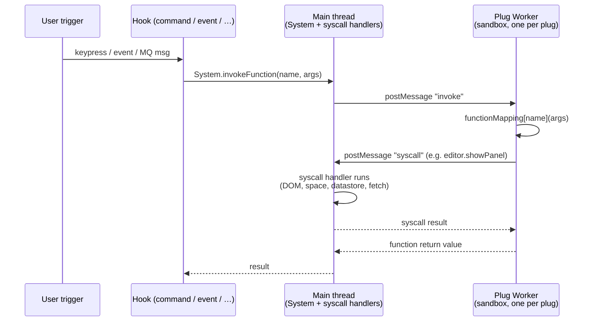

# Development Notes

Living notes for working on the SilverBullet Object Graph plug. Audience: humans and agents who want to ship a change without re-reading the whole codebase first. Updated as we learn more.

## SilverBullet concepts

These come from the SilverBullet core repo (https://github.com/silverbulletmd/silverbullet). Worth skimming when context is missing.

- **Space** — SilverBullet's word for a workspace. Concretely: a folder of Markdown pages, documents, and assets. Other tools call this a vault (Obsidian) or graph (LogSeq).
- **Page / Meta page** — every `.md` file in a space is a page. Tagging it with `meta` or `meta/*` marks it as a meta page (config, library entries, etc.), which by convention is hidden from the knowledge graph.
- **Plug** — a self-contained JS bundle (`*.plug.js`) that extends SilverBullet. Each plug runs in its **own Web Worker**, isolated from the main thread and from other plugs. It cannot touch the DOM directly. Source of truth: `silverbullet/website/Plugs/Development/Architecture.md` and `silverbullet/client/plugos/`.
- **Syscalls** — the only way a plug talks to the editor / space / storage. Plug code imports wrappers from `@silverbulletmd/silverbullet/syscalls` (e.g. `editor`, `system`, `datastore`, `config`, `asset`, `index`, `lua`); under the hood these call `globalThis.syscall(name, ...args)` which postMessages to the main thread. Catalog: `silverbullet/plug-api/syscalls/`.
- **`index.queryLuaObjects(tag, query, scopedVariables?)`** — the canonical query shape. `query` is `{ objectVariable, where? }` where `where` is a parsed Lua expression (`await lua.parseExpression("…")`), not a tree-form predicate. Scoped variables are passed as the third arg. Reference call site: `silverbullet/plugs/index/link.ts:getBackLinks`.
- **Hooks** — the manifest entries that wire a plug function to a trigger. We use `command:` (palette + keybinding). Others exist: `slashCommand`, `events`, `mqSubscriptions`, `codeWidget`, `editor` (document editor), `syscall`. Types: `silverbullet/plug-api/types/manifest.ts`.
- **Plug discovery** — at boot, SilverBullet loads every `*.plug.js` it can find in the overlaid filesystem (built-in plugs from `Library/Std/Plugs`, user plugs anywhere in the space, e.g. under `Library/...` or `_plug/`). No registration step.
- **Library** — the distribution unit for plugs. A library is a meta-page (`tags: meta/library`) with a `files:` frontmatter listing the `.plug.js` (and any other assets) to ship alongside the page. Users install it via `Library: Install <uri>`. Our `ObjectGraph.md` is exactly such a library page.
- **Relation index** — SilverBullet's indexer publishes a `relation` object kind: typed edges between any two indexed refs (page → page, page → item, item → tag, …). Each relation row carries `from`, `to`, `kind` (`mention`, `attribute`, `frontmatter`, `yaml-block`, `co-mention`, `url`, `file`), an optional `type` (the user-defined label), and provenance (`page`, `pos`). This is the data backbone of the object graph — we query it via `index.queryLuaObjects("relation", …)`.

### Plug runtime model



Two message types only: **invoke** (main → worker, "run this function") and **syscall** (worker → main, "do this for me"). Code: `silverbullet/client/plugos/sandboxes/worker_sandbox.ts`, `silverbullet/client/plugos/worker_runtime.ts`.

### Panels are a separate context

`editor.showPanel("modal", height, html, script)` injects the supplied HTML and runs the script in **a separate iframe-like context**, not the worker. The script can't import from the plug — data is passed by inlining JSON. That's why this plug splits code in two:

- `src/` — runs in the plug worker, has syscalls, no DOM.
- `ui/` — bundled into an asset, runs in the modal panel, has the DOM (Preact), and a subset of syscalls (`datastore` is reachable from the panel; see `ui/components/app.tsx`).

The bridge is `RootViewModel` JSON, inlined as a global by `src/graph_html.ts`. Further expansions don't reinline anything — the panel calls back into the worker via `system.invokeFunction("object-graph.expandObject", ref)` and merges the result into its local state.


## Build pipeline

`npm run build` runs `plug-compile object-graph.plug.yaml`. The compiler (`silverbullet/client/plugos/plug_compile.ts`) does, in order:

1. Run each entry in the manifest's `build:` list. Supported step types: `esbuild` (default, bundles `in` → `out` as a browser IIFE), `sass` (compile SCSS → CSS), `copy`. Our manifest bundles `ui/index.tsx` → `assets/object-graph.js` and compiles `ui/object-graph.scss` → `assets/object-graph.css`.
2. Bundle everything matched by `assets:` into the plug manifest as inlined data.
3. Generate a tiny JS shim that `import`s every function listed in `functions:` from its `path:` and registers them with `setupMessageListener` (from the worker runtime).
4. esbuild-bundle the shim into `<plug-name>.plug.js`. Minified by default; pass `--debug` for readable output.

Scripts:

```sh
npm run build         # produce object-graph.plug.js in the repo root
npm run build:deploy  # build, then copy object-graph.plug.js + ObjectGraph.md
                      #   → demo-space/Library/zefhemel/silverbullet-object-graph/
```
Re-run `build:deploy` after each change and reload the plug in the running SilverBullet. Reload the page to pick up the new version.
